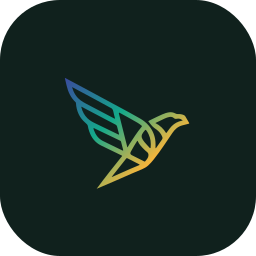

<div align="center">



# GRU953 Markdown

**Turn any document into clean, readable text — in one click.**

Word files, PDFs, spreadsheets, and images — converted instantly, right on your computer. No accounts, no subscriptions, no internet required.

<br>

[](https://github.com/GRU-953/gru953-markdown/releases/latest)
&nbsp;
[](LICENSE)
&nbsp;
[](https://github.com/GRU-953/gru953-markdown/actions)

<br>

*Simple technology. For everyone.* &nbsp;·&nbsp; *সহজ প্রযুক্তি। সবার জন্য।*

</div>

---

## ⬇️ Download

> **[→ Click here to download GRU953 Markdown for Windows](https://github.com/GRU-953/gru953-markdown/releases/latest)**

On the download page, look for the file named **GRU953Markdown-Setup.exe** and click it.

- **Double-click the installer** — it sets up the app in seconds
- Or download **GRU953Markdown.exe** (the portable version) to run it directly with no installation at all
- If Windows shows a blue warning screen, click **More info → Run anyway** — this is normal for new apps and is safe

Runs on **Windows 10 and Windows 11** (64-bit). No Python, no extra software, no technical setup needed.

---

## 🚀 How to use it — three steps

### Step 1 · Open the app
Double-click the app icon. It will open in a few seconds.

### Step 2 · Add your files
- **Drag and drop** any document onto the large drop area in the middle of the screen, or
- **Click inside the drop area** to browse your files normally
- You can add **multiple files at once** — mix documents, PDFs, and images together

### Step 3 · Convert and save
Click the **Convert all** button. Your text is ready almost instantly.

- Click **Copy** to put the text straight on your clipboard — then paste it anywhere
- Click **Export** to save it as a file — you can choose Markdown (`.md`), plain text (`.txt`), or a web page (`.html`)
- Click **Export all** to combine everything into a single file

That is all. No sign-up, no internet connection needed, no subscription.

---

## 📄 What files does it work with?

Drop any of these in and get clean, readable text out:

| What you have | File type |
|---|---|
| Word documents | `.docx`, `.doc` |
| PDF files | `.pdf` |
| PowerPoint presentations | `.pptx` |
| Excel spreadsheets | `.xlsx` |
| Photos and scanned pages | `.png`, `.jpg`, `.jpeg`, `.tiff`, `.bmp`, `.gif`, `.webp` |
| Web pages saved as files | `.html` |
| Data files | `.csv`, `.json`, `.xml` |
| Compressed folders | `.zip` |
| Old-format text | `.rtf`, `.txt` |

> **Images and scanned documents are handled automatically.** Drop a photo of a printed page or a scanned document, and the app reads the text for you using built-in OCR — no extra steps needed.

---

## 🔤 Bengali / Bangla support

GRU953 Markdown understands old Bangla computer fonts that are common in documents from Bangladesh. If your file was typed using a legacy Bangla font like **Bijoy** or **SutonnyMJ**, the app automatically converts the text to proper Unicode so it displays and copies correctly in any app, browser, or document.

There is also a dedicated **Bangla tab** in the sidebar. Open it to paste Bangla text directly and convert it to Unicode on the spot — useful when you have copied text from an older source or website.

---

## ⚙️ Settings and customisation

Click the **Settings** icon at the bottom of the left sidebar to personalise your experience.

| Setting | What it does |
|---|---|
| **Language** | Switch the whole app between English and বাংলা instantly |
| **Appearance mode** | Choose Light, Dark, or Auto (follows your system setting) |
| **Windows colours** | Use your Windows accent colour as the app's theme colour |
| **Colour theme** | Pick one of three colour palettes — Teal, Indigo, or Amber |
| **Auto-OCR** | Automatically read text from image files when you convert them |
| **Auto Bijoy** | Automatically detect and convert Bijoy-encoded text |
| **Default OCR language** | Set English, Bangla, or Both for image text recognition |

---

## 🎨 Colour themes

Three built-in themes, each available in light and dark mode:

| Theme | Personality |
|---|---|
| **GRU953 Teal** | Fresh and clean — the default |
| **GRU953 Indigo** | Deep and focused |
| **GRU953 Amber** | Warm and energetic |

On Windows, you can also turn on **Windows colours** in Settings to use your system accent colour automatically — the app follows your Windows personalisation settings and switches between light and dark with your system.

---

## 💾 Conversion history

The **History tab** keeps a record of every file you have converted. You can see which files succeeded, which had warnings, and clear the list whenever you like.

Hover over any history entry and click the **+** button to add that file straight back to the Convert queue — no need to find and open it again.

---

## ❓ Frequently asked questions

**The app won't open — Windows is blocking it.**
Click **More info** on the Windows warning, then click **Run anyway**. This happens because the app is new and not yet widely recognised by Windows SmartScreen.

**My PDF converted but the text looks wrong.**
The PDF may be a scanned image with no real text. Make sure **Auto-OCR** is turned on in Settings and try again — the app will read the image layer automatically.

**The text came out garbled or in the wrong language.**
If the file uses a legacy Bangla font (Bijoy/SutonnyMJ), the Auto Bijoy setting in Settings should fix it automatically. Make sure it is turned on.

**Can I convert multiple files at once?**
Yes. Drop as many files as you like into the drop area. They all convert together when you click Convert all.

**Are there keyboard shortcuts?**
Yes: **Ctrl + Enter** converts all files. **Ctrl + O** opens the file browser. **Ctrl + S** exports the current file. **Ctrl + Shift + S** exports all converted files together. In the file list, **Arrow Up / Arrow Down** moves between files so you can preview each one without using the mouse.

**Does the app send my files to the internet?**
No. Everything happens entirely on your computer. Your files never leave your machine. The only internet access the app uses is to check for updates in the background, and that can be ignored entirely.

**Something is not converting correctly. What do I do?**
[Open an issue on GitHub](https://github.com/GRU-953/gru953-markdown/issues) — describe what happened, what file you tried, and what you expected. We will take a look.

---

## About GRU953

GRU953 is a not-for-profit, open-source product organisation on a mission to make technology simple and accessible for everyone — with a home in Bangladesh. All GRU953 apps are free, open-source, and built openly for the world.

*Simple technology. For everyone.* &nbsp;·&nbsp; *সহজ প্রযুক্তি। সবার জন্য।*

&nbsp;

<details>
<summary>🔧 For developers</summary>

&nbsp;

**Run from source**

```bash
git clone https://github.com/GRU-953/gru953-markdown.git
cd gru953-markdown
pip install -r requirements.txt
python app.py
```

**Build the standalone exe**

```bash
build_exe.bat
# Output: dist\GRU953Markdown.exe
```

**Run the test suite**

```bash
pip install pytest pytest-cov
pytest tests/ -v
# 250 tests across pipeline, bijoy_unicode, ocr_engine, settings
```

Built with [pywebview](https://pywebview.flowrl.com/) · [MarkItDown](https://github.com/microsoft/markitdown) · [Tesseract OCR](https://github.com/tesseract-ocr/tesseract) · DM Sans · Noto Sans Bengali  
See [CHANGELOG.md](CHANGELOG.md) for version history.

</details>

---

**License:** Apache-2.0 — free to use, modify, and share. See [LICENSE](LICENSE).
